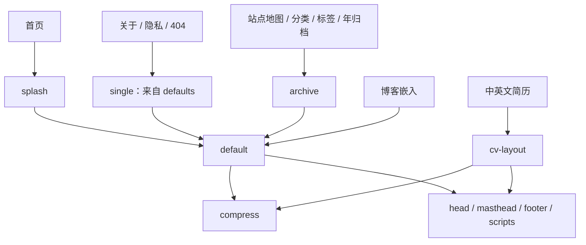

# 上游脱钩检查与实施建议

检查日期：2026-09-22。基线提交：`9c0767feee68f280a6ba7f5bd256df432efc4079`。

构建对比、依赖变化、实验 Gemfile 和验证边界另见[结构化实验记录](audits/upstream-independence-2026-09-22.json)。

本次检查覆盖 Git/GitHub 仓库关系、发布配置、Ruby/Node 依赖、Liquid 模板引用、Sass 导入、页面资源、公开路由、项目标识和许可证。进行了实际构建、现有测试以及临时副本中的依赖拆分实验。正式源码和线上部署均未修改。

## 结论与目标

**仓库和构建已经不依赖 Academic Pages 仓库；尚未完成的是对复制而来的模板代码、功能范围和构建依赖的自主维护。**

建议把“完全脱钩”定义为：

- 内容、设计、配置和依赖版本均由本项目决定，不需要同步或查阅 Academic Pages 才能维护。
- 构建、预览和发布不下载 Academic Pages / Minimal Mistakes 的主题或资源。
- 每个保留的模块都有当前用途或明确的维护理由，删除无用途的模板功能。
- 历史来源和第三方许可证得到保留，自己的代码与第三方代码的维护边界明确。

继续使用 Jekyll、GitHub Pages 或通用开源库不妨碍上述目标。彻底重写全部历史代码、清空 Git 历史、迁移到另一个框架，都不是脱钩的前置条件。若还希望替换旧模板的布局机制，可作为后续结构整理单独完成。

## 1. 已经独立的部分

| 检查项 | 实际结果 | 判断 |
| --- | --- | --- |
| GitHub fork 关系 | API 返回 `isFork=false`、`parent=null` | 无需申请 detach，也无需删除重建仓库 |
| Git remote | 只有本项目 `origin` | 没有 upstream remote |
| Git 历史 | 当前 HEAD 有 168 个提交，唯一根提交为 2025-05-28 的 `2d74c72` | 根提交已经包含模板快照；保留历史即可，不能据此还原准确的上游导入 SHA |
| 主题配置 | 没有 `theme:` / `remote_theme:`；布局、include、Sass 均在仓库内 | 没有远程主题加载；`site_theme` 是本项目的配色开关，不是 Jekyll 主题依赖声明 |
| 发布配置 | GitHub Pages API：`build_type=workflow`；两个自有工作流构建并上传 `_site` | 不调用上游工作流，不需要上游仓库权限 |
| 依赖获取 | Gem 来自 RubyGems，npm 包来自包注册表 | 未发现 Git 子模块或指向 Academic Pages 的 Git 依赖 |
| 当前生成页面 | 15 个 HTML 文件；扫描资源引用，唯一的外部加载项是自己的博客 iframe | 未发现加载上游站点资源；指向上游的普通链接属于来源介绍 |

GitHub 上与基线提交对应的 [Site Check](https://github.com/husky1102/husky1102.github.io/actions/runs/35429865385) 和 [Deploy Pages](https://github.com/husky1102/husky1102.github.io/actions/runs/35429865366) 均成功。API 返回的其他动态工作流（例如 Dependabot、CodeQL）属于平台功能，不是 Academic Pages 同步流程。

这里的资源检查是生成 HTML 和源代码检查，不是浏览器网络抓包；没有检查博客 iframe 内部的外部依赖，也没有做断网安装实验。

## 2. 最值得优先解决的构建依赖

[`Gemfile`](../Gemfile) 仍直接依赖 `github-pages`。[`Gemfile.lock`](../Gemfile.lock) 将它锁在 231，进一步锁定：

- Jekyll 3.9.5；
- jekyll-sass-converter 1.5.2、Ruby Sass 3.7.4；
- 13 个 `jekyll-theme-*` 包，以及 Minima；
- 多个当前站点未使用的 GitHub Pages 插件。

这些主题包被安装不代表它们正在渲染页面。问题是本项目仍承担整套 Pages 依赖集合的解析、安装和升级成本。`github-pages` 是 GitHub 的依赖集合，也不能将它误称为 Academic Pages 的远程依赖。

站点已经自行生成和上传静态文件，因此可以自行维护 Gemfile，不必为了托管于 GitHub Pages 而保留这套集合。该部署方式由 [GitHub 自定义工作流文档](https://docs.github.com/en/pages/getting-started-with-github-pages/using-custom-workflows-with-github-pages)支持；Jekyll 也支持把主题文件转为本地维护文件并显式声明所需插件，见 [Jekyll 主题文档](https://jekyllrb.com/docs/themes/)。

### 已完成的临时副本实验

从当前已跟踪文件复制独立目录，保留源文件修改时间，在副本中：

1. 删除 `gem 'github-pages'`。
2. 把 Jekyll 显式固定为现有 `3.9.5`，避免同时发生版本升级。
3. 显式声明当前配置仍启用的 `jekyll-gist 1.5.0`、`jekyll-paginate 1.1.0`。
4. 显式声明 `kramdown-parser-gfm 1.1.0`。
5. 保留其他直接依赖，通过 `bundle lock --local` 重新解析，再构建和测试。

**步骤 4 不是推测：第一次构建确实因缺少 `kramdown-parser-gfm` 失败。** `_config.yml` 指定了 `kramdown.input: GFM`，这个依赖此前由 `github-pages` 间接提供。

| 验证项 | 实验结果 |
| --- | --- |
| 锁文件 spec 记录数 | 95 → 52，减少 43 条；按不同包名计为 94 → 51，差异来自平台变体 |
| 主题包 | 14 → 0 |
| `bundle check` | 通过 |
| `jekyll build --safe --trace --profile` | 通过 |
| 现有 Node 测试 | 48 / 48 通过 |
| 发布文件数量 | 两边均为 101，路径集合完全相同 |
| 文件内容比较 | 100 个逐字节相同；`feed.xml` 仅 `<updated>` 构建时间不同 |
| HTML、CSS、JS、图片和字体 | 文件内容保持一致 |

这证明可以先脱离构建依赖集合而不改变当前页面。实验仍使用现有 Ruby Gem 缓存，并未验证全新 Linux 环境安装；正式实施时需由 CI 补齐该验证。Python 资产测试在原始基线中已通过，实验副本未重复执行。

暂时固定 Jekyll 3.9.5 是隔离迁移变量的过渡措施，不是长期版本建议。Jekyll 4、Sass 转换器和旧 Sass 代码的兼容性应另设阶段，不能直接在删除 `github-pages` 的同时执行无约束全量升级。[Jekyll 3→4 升级说明](https://jekyllrb.com/docs/upgrading/3-to-4/)也列出了渲染和依赖变化。

### 插件的取舍

| 插件或依赖 | 当前用途 | 建议 |
| --- | --- | --- |
| `jekyll-sitemap` | 生成 sitemap.xml、robots.txt，现有测试依赖 | 保留并显式维护 |
| `jekyll-redirect-from` | about.html、resume、resume_zh、旧博客入口 | 保留；清理模板时不能顺带破坏旧链接 |
| `kramdown-parser-gfm` | 当前 Markdown 解析配置需要 | 必须显式保留 |
| `jekyll-feed` | 确实生成 feed.xml，但当前没有文章 | 第一阶段保留产物；确定本仓库不承载文章后再决定停用 |
| `jekyll-gist` | 未发现当前内容使用 gist 标签 | 后续可删除声明及配置 |
| `jekyll-paginate` | 未启用分页，分页 include 不可达 | 后续可删除声明及配置 |
| `jemoji` | 本次未发现当前页面实际依赖的短代码 | 删除前做生成内容比较，避免将字体覆盖测试当作表情行为测试 |
| `connection_pool = 2.5.0` | 历史兼容固定版本；临时实验保留 | 检查保留依赖的反向依赖及固定原因后再决定，不与第一阶段混改 |

`_includes/base_path` 和 `seo.html` 还有 `site.github.url` 回退。本项目已明确设置 `site.url`，当前不会走该分支；自主维护后应把 `url` / `baseurl` 作为明确配置契约，删掉隐含的 GitHub Metadata 回退。

## 3. 模板残留：需要按可达性处理

与本仓库最初导入提交比较，而非与今天的上游版本比较：

| 范围 | 当前文件数 | 与最初导入完全相同 |
| --- | ---: | ---: |
| `_layouts` | 8 | 4 |
| `_includes` | 45 | 34 |
| `_sass` | 114 | 96 |
| 其中 `_sass/vendor` | 94 | 94 |

这些数字说明仍有大量继承代码，但不能把“未改过”直接等同于“无用”。真实构建的 profile 记录了 6 个仓库内布局、19 个 include；另外 26 个 include 在本次内容配置下未执行。这同样不能作为全部删除的依据：条件分支和未来论文内容会改变调用路径。

当前主要渲染路径：

### 第一批：没有当前页面引用路径的删除候选

静态引用检查已计入 `_config.yml` 中的默认 `single` 布局，并保守保留条件分支。以下 8 个文件在当前页面入口图中不可达：

- `_layouts/archive-taxonomy.html`
- `_layouts/talk.html`
- `_includes/archive-single-cv.html`
- `_includes/archive-single-talk-cv.html`
- `_includes/archive-single-talk.html`
- `_includes/feature_row`
- `_includes/gallery`
- `_includes/paginator.html`

其中 `talk.html` 仍被空的 `talks` collection 默认配置引用。因此应连同拟退役的 collection/defaults 一起处理；不能笼统宣称这些文件在整个仓库中都没有引用。实施时还要同步检查样式、配置、字体扫描来源和测试。

`assets/js/collapse.js`、`assets/css/collapse.css` 没有被当前布局或资源入口引用，却会随站点发布，也可列入第一批清理。

### 第二批：关闭但仍连着主布局的功能

- 评论系统：`comments.html`、`comments-providers/*`、Staticman 配置及评论表单样式。
- 统计系统：`analytics.html` 和四种 provider；当前 provider 为空。
- 文章分享、文章前后导航、标签分类、阅读时间、相关文章。
- Hero、面包屑、多种作者社交账号分支。
- 多语言模板词条与 `_data/interface.yml` 中现有中英文界面词条并存。

这类功能应先明确本站需要保留的行为，再移除调用和配置，最后删除实现。`toc` 仍被隐私页使用；`archive-single.html` 仍用于 HTML 站点地图；`single.html` 仍用于三个页面；不能整目录删除。

### 论文功能应有意保留

`teaching`、`portfolio`、`talks`、`publications` 目前都没有实际文档，但中英文 CV 明确遍历 `site.publications`，并调用 `publication-resource-links.html`。

**建议保留一个精简的论文数据入口和简历展示能力，退役教学、演讲和作品集的空骨架。** 论文能力与个人研究主页用途一致；“暂无论文记录”不能自动推导为“不再需要论文功能”。若保留论文详情页，也应保留其独立路由规则和最小布局。以后确需教学或演讲内容时，按实际需求重新加入。

## 4. 公开路由不能按“空模板”直接删除

当前发布 11 个内容页面和 4 个重定向 HTML。

| 路由 | 当前状态 | 建议 |
| --- | --- | --- |
| `/`、`/about/`、`/cv/`、`/cv_zh/`、`/blog_embed/` | 核心内容 | 保持 URL、语言和页面行为 |
| `/terms/`、`/404.html` | 辅助页面 | 保留 |
| `/sitemap/` | 实际列出页面，同时暴露空 collection 标题 | 保留链接能力，可改为本站专用页面列表 |
| `/categories/`、`/tags/`、`/year-archive/` | 没有 `_posts`，页面主体为空 | 建议退役空归档，旧入口转到 `/blog_embed/`；这是待实施的路由策略，不是本次已执行操作 |
| `/wordpress/blog-posts/` | 当前转到空的年归档 | 随归档退役直接转到博客入口，避免重定向链 |
| `/about.html`、`/resume`、`/resume_zh` | 保留的历史入口 | 继续保持当前目标；构建文件分别为 about.html、resume.html、resume_zh.html |

移除 `jekyll-redirect-from` 会直接影响历史入口。GitHub Pages 上这些插件重定向由生成 HTML 实现；不能未经验证把它描述成服务器 HTTP 301。

## 5. 前端仍承担旧模板功能成本

### JavaScript

[`package.json`](../package.json) 把 jQuery、FitVids、Magnific Popup、jquery-smooth-scroll 全部合并进每页加载的 `main.min.js`。但导航脚本虽然仍叫 `jquery.greedy-navigation.js`，实现已经使用原生 DOM，不依赖 jQuery。

扫描本次生成的全部 HTML，并按现有初始化选择器检查：

- FitVids 的目标视频或 object：0 个；自己的博客 iframe 不匹配它的默认选择器。
- 自动灯箱匹配的图片链接：0 个。
- 可被自动包裹的 `p > img:not(.emoji)`：0 个。
- 锚点链接：仍存在，因此不能直接删 smooth-scroll 而不处理滚动偏移和减少动态效果偏好。

建议移除无目标的 FitVids、灯箱初始化及依赖；以原生锚点滚动和正确的滚动偏移代替 smooth-scroll，再移除 jQuery。保留已有原生导航、主题同步、博客通信、首页 GSAP 动画和可访问性行为。每一步都需要浏览器验证，不能仅用当前正则测试判定等价。

基线资源大小：main.min.js 为 121,833 字节（gzip 约 42,012）；home-motion.min.js 为 114,876 字节（gzip 约 44,684），后者已只在首页加载。这里的 gzip 是本地测量，非线上传输实测。

### CSS 与字体

[`assets/css/main.scss`](../assets/css/main.scss) 仍导入 Susy、Breakpoint、Font Awesome、Magnific Popup 和通用主题布局，然后再加载 1,295 行 `custom.scss`。

Susy/Breakpoint 仍被 page、sidebar、archive 等布局调用；它们不是可以直接删除的闲置目录。若目标包含摆脱旧布局机制，应按页面逐步迁移到明确的 Grid/Flex 和媒体查询，把生效规则归回对应样式文件，再移除旧库。不要在旧样式上继续增加一层全局覆盖来宣称完成脱钩。

生成的 main.css 为 209,001 字节（gzip 约 42,769）。这不是全部可删除体积，包含图标、实际布局和当前自定义样式。

Academicons 当前未在任何内容页面加载，但两份 CSS 和四种字体格式仍发布，合计 672,275 字节。删除主要减少部署文件和维护面，不能把这约 657 KiB 全算作当前首页网络节省。可选择完全退役，或明确保留给未来学术账号链接。

## 6. 标识、开发环境和来源声明

| 文件 | 残留 | 建议 |
| --- | --- | --- |
| `.devcontainer/devcontainer.json` | 名称为 `ACADEMIC PAGES` | 使用项目自己的名称 |
| `.github/ISSUE_TEMPLATE/bug_report.md` | 询问错误发生于 template 还是用户自己的站点 | 改为本站访问路径、设备、实际与预期行为 |
| `images/manifest.json` | 名称为 `OOjs UI icon academic-progressive` | 改为本站名称；图标来源信息与应用名称分别维护 |
| `package.json` | `theme/minimal` 关键词、继承的版本号和 contributors | 描述为私有个人站点构建项目；原贡献者归属记录不应机械抹掉 |
| `README.md`、关于页 | 介绍站点基于 Academic Pages 持续调整 | 可改为“独立维护，初始代码源自……”，避免暗示仍同步上游 |
| `_config.yml` | 大量模板示例、空账号、空 collection、旧工具 exclude | 收敛到实际支持项；发布排除规则保留必要的防泄漏边界 |

Docker 当前只安装 Ruby 依赖与发行版 Node，不安装 Python 字体工具，也没有 npm 依赖安装和资源构建步骤。它能利用已提交资源启动 Jekyll，但不是 README 所描述的完整可复现开发环境。正式独立维护时应明确：要么完善为支持 Node 22、Python 和全部生成步骤的环境，要么明确其只是 Jekyll 预览环境。删除 `github-pages` 本身不会自动解决这一差异。

### 版权和许可应保留

根 [`LICENSE`](../LICENSE) 含 Michael Rose 的 MIT 版权声明；本仓库仍保留大量导入代码。MIT 要求在软件副本或实质部分保留相应版权与许可，因此不能把删除作者名字当作脱钩动作。[MIT 原文](https://opensource.org/license/mit)

建议增加可维护的第三方来源清单，区分初始模板、复制进仓库的库、包管理器依赖和字体，并记录能够核实的版本或来源。最初导入对应的上游提交尚未确认，不要编造 SHA。

需要进一步补齐的分发记录：

- Font Awesome 6.5.2 的源文件带有许可注释，应继续保留；字体和代码的许可不同，见[该版本官方许可文件](https://raw.githubusercontent.com/FortAwesome/Font-Awesome/6.5.2/LICENSE.txt)。
- Academicons 1.9.4 的字体为 OFL、CSS 为 MIT，见[该版本官方说明](https://github.com/jpswalsh/academicons/blob/v1.9.4/README.md)。本次未审计每个二进制字体的嵌入版权元数据，不能仅凭缺少独立文本文件断言违规。
- 两个压缩 JS 产物未检出版权/许可标识，构建命令也没有保留许可注释的选项；根 LICENSE 又被排除在 `_site` 外。应逐项核对保留库的分发要求，为发布产物保留适当 banner 或随包许可文本。
- GSAP 包声明自身的 Standard license，FitVids 包声明 WTFPL；不能把所有第三方文件统一标成本站 MIT。
- 现有 LXGW 与 Maple Mono 的字体许可文件应继续随字体保留。

“保留来源与许可”与“独立维护”完全兼容。许可清单不必成为页面主文案，维护身份和历史归属也不应混为一谈。

## 7. 建议的实施顺序

以下是后续实施方案；本次交付仅为分析及验证结果。

| 阶段 | 独立交付结果 | 修改范围 | 验收重点 |
| --- | --- | --- | --- |
| 1. 自主管理构建 | 不再安装 Pages 主题集合，页面保持等价 | Gemfile/lock、明确 URL 契约、文档与许可证清单 | 全新 CI 安装、48+2 测试、发布文件对比；只归一化确实由时间产生的差异 |
| 2. 收敛功能与身份 | 清除空模板功能和旧项目标识 | 配置、不可达模板、旧归档路由、manifest、开发容器及 issue 模板 | 旧入口目标明确，核心 URL 不变，论文入口保留，站点地图无空壳内容 |
| 3. 精简前端 | 每个运行时依赖对应实际页面行为 | JS 初始化、包依赖、灯箱样式、闲置静态资产 | 移动导航、主题、博客通信、锚点、键盘操作、减少动态效果和无 JS 阅读回归 |
| 4. 整理旧布局机制 | 站点样式结构能够独立理解维护 | 布局样式、custom.scss、Susy/Breakpoint，之后另行升级 Jekyll/Sass | 桌面/移动、明暗主题、简历打印的视觉对照和现有测试 |

每个阶段单独提交，且只包含本任务变更。Jekyll/Sass 升级应在布局兼容性准备好后再执行，即使它位于阶段 4，也应拆成独立提交以便回退。

阶段 1–3 可以完成独立维护所需的主要工作；阶段 4 用于进一步降低历史架构成本。若要求代码层面也不再沿用旧模板布局，则阶段 4 也属于完成条件。切换到 Astro/Next.js 等框架只有在另有明确产品需求时才值得单独评估，不建议为“去上游名字”而启动整站迁移。

## 8. 完成标准与验证边界

正式实施后应满足：

1. 无上游同步工作流、远程主题、上游资源请求；来源链接和许可文本不受此限制。
2. Gemfile 显式声明站点所需依赖，锁文件中无无用途的 Pages 主题集合。
3. 保留论文能力等有明确用途的扩展，移除未采用的模板产品功能。
4. 当前核心 URL、历史简历入口、语言、SEO、博客主题通信与阅读入口保持正确。
5. 源文件生成的 JS/字体与提交产物一致，公开目录不泄漏源资产、工具状态或依赖目录。
6. 浏览器实际验证桌面和移动尺寸、明暗主题、菜单、锚点、键盘与打印；不能把静态源码正则检查当作这些验证。
7. 原作者版权和第三方许可随适当的源文件/发布产物保留，新维护文档不再依赖阅读上游教程。

本次已执行：`bundle check`、JS/字体重建、Jekyll clean/build/profile、`npm test`、生成产物无漂移检查、模板可达性分析、生成页面资源和插件目标扫描、临时拆包构建及发布文件哈希比较。

本机为 Ruby 3.3.12、Node 22.22.3；临时 Python 环境使用 3.14，安装仓库锁定的 fonttools 4.60.2 / brotli 1.2.0，字体输出与提交文件一致。CI 声明 Python 3.12，本次没有宣称本机环境与 CI 完全一致。

未执行：正式依赖迁移、删除生产文件、Git 历史重写、推送部署、全新 Linux 安装、Jekyll 4 试迁移、全站浏览器交互与视觉验证、二进制字体完整许可证审计。代码来源统计以本仓库初始提交为基准，不代表对当前上游的逐文件兼容性比较。
