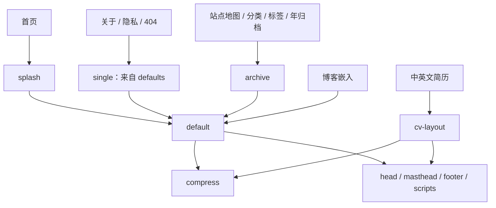

# 上游脱钩检查与实施建议

检查日期：2026-09-22。基线提交：`9c0767feee68f280a6ba7f5bd256df432efc4079`。

构建对比、依赖变化、实验 Gemfile 和验证边界另见[结构化实验记录](audits/upstream-independence-2026-09-22.json)。

本次检查覆盖 Git/GitHub 仓库关系、发布配置、Ruby/Node 依赖、Liquid 模板引用、Sass 导入、页面资源、公开路由、项目标识和许可证。进行了实际构建、现有测试以及临时副本中的依赖拆分实验。正式源码和线上部署均未修改。

## 结论与目标

**用户已明确目标：彻底替换 Academic Pages / Minimal Mistakes 的继承实现，使当前项目能够移除原模板的全部专属信息。独立第三方依赖与框架可以保留。**

仓库没有 fork 关系、能够独立构建，只是现状，不代表已经达到这个目标。原报告中“独立维护即可、布局重写可选”的判断已被本次范围澄清取代；下文的现状数据和临时构建实验仍然有效。

完成条件是：

- 原模板的布局、组件、样式、脚本、功能胶水与配置被删除或由本项目自己的实现替换；改名、搬目录、转换语法或局部改写不算完成。
- 保留当前需要的页面效果、内容、路由与交互，以用户行为和视觉结果作为重建依据，而不是逐句翻写旧模板。
- 原模板的项目名称、来源链接、维护说明、示例内容与专属元数据从交付版本中退出；对应版权声明的处理以实际代码来源复核为前提。
- Jekyll、GitHub Pages、GSAP、jQuery、图标和字体等独立第三方能力允许保留，按它们自己的来源、版本与许可证维护。

不需要更换框架，也不要求重写已经能够核实为本站原创的功能。未知来源或混合了模板实现的部分必须继续核实，无法可靠分离时重新实现，不能默认为原创。

本方案的验收对象是最终工作树与发布产物。旧 Git 提交及其版权、历史审计记录另属历史档案；清空历史不由本次澄清自动授权。迁移结束时，本报告及实验记录也要从最终工作树移出，改成不含模板来源叙述的当前架构文档，旧记录仍可由历史提交查阅。

### 三类来源的处置边界

| 来源 | 处置原则 | 本项目中的例子 |
| --- | --- | --- |
| 原模板实现或混合衍生实现 | 不再保留；需要的功能自行实现，不需要的功能删除 | 模板布局、作者侧栏、归档、SEO 拼装、模板主题规则、继承的导航逻辑 |
| 本站原创内容与实现 | 核实来源后保留；与旧模板耦合的接口重新接入 | 个人内容、博客消息协议、角色图片与生成流程、首页动画、自定义指针；具体文件仍须逐项核实 |
| 独立第三方库与框架 | 可直接依赖；从其自身发行来源固定版本并保留其许可 | Jekyll、GSAP、jQuery、Font Awesome、字体；Susy/Breakpoint、HTML 压缩工具也按独立来源核实 |

第三方库曾随模板一起复制进来，不会因此自动成为必须重写的模板代码。应从库本身重新引入或核对官方版本，单独替换模板为它编写的适配代码。该原则也意味着“移除 jQuery”只是可选优化，不是本任务的完成条件。

## 1. 已经独立的部分

| 检查项 | 实际结果 | 判断 |
| --- | --- | --- |
| GitHub fork 关系 | API 返回 `isFork=false`、`parent=null` | 无需申请 detach，也无需删除重建仓库 |
| Git remote | 只有本项目 `origin` | 没有 upstream remote |
| Git 历史 | 检查基线有 168 个提交，唯一根提交为 2025-05-28 的 `2d74c72` | 根提交已经包含模板快照；不能据此还原准确的上游导入 SHA，历史清理与当前实现替换分别处理 |
| 主题配置 | 没有 `theme:` / `remote_theme:`；布局、include、Sass 均在仓库内 | 没有远程主题加载；`site_theme` 是本项目的配色开关，不是 Jekyll 主题依赖声明 |
| 发布配置 | GitHub Pages API：`build_type=workflow`；两个自有工作流构建并上传 `_site` | 不调用上游工作流，不需要上游仓库权限 |
| 依赖获取 | Gem 来自 RubyGems，npm 包来自包注册表 | 未发现 Git 子模块或指向 Academic Pages 的 Git 依赖 |
| 当前生成页面 | 15 个 HTML 文件；扫描资源引用，唯一的外部加载项是自己的博客 iframe | 未发现加载上游站点资源；指向上游的普通链接属于来源介绍 |

GitHub 上与基线提交对应的 [Site Check](https://github.com/husky1102/husky1102.github.io/actions/runs/35429865385) 和 [Deploy Pages](https://github.com/husky1102/husky1102.github.io/actions/runs/35429865366) 均成功。API 返回的其他动态工作流（例如 Dependabot、CodeQL）属于平台功能，不是 Academic Pages 同步流程。

这里的资源检查是生成 HTML 和源代码检查，不是浏览器网络抓包；没有检查博客 iframe 内部的外部依赖，也没有做断网安装实验。

## 2. 构建依赖的现状与已验证的准备工作

[`Gemfile`](../Gemfile) 仍直接依赖 `github-pages`。[`Gemfile.lock`](../Gemfile.lock) 将它锁在 231，进一步锁定：

- Jekyll 3.9.5；
- jekyll-sass-converter 1.5.2、Ruby Sass 3.7.4；
- 13 个 `jekyll-theme-*` 包，以及 Minima；
- 多个当前站点未使用的 GitHub Pages 插件。

这些主题包被安装不代表它们正在渲染页面。问题是本项目仍承担整套 Pages 依赖集合的解析、安装和升级成本。`github-pages` 是 GitHub 的依赖集合，也不能将它误称为 Academic Pages 的远程依赖。

站点已经自行生成和上传静态文件，因此可以自行维护 Gemfile，不必为了托管于 GitHub Pages 而保留这套集合。该部署方式由 [GitHub 自定义工作流文档](https://docs.github.com/en/pages/getting-started-with-github-pages/using-custom-workflows-with-github-pages)支持；Jekyll 也支持把主题文件转为本地维护文件并显式声明所需插件，见 [Jekyll 主题文档](https://jekyllrb.com/docs/themes/)。

### 已完成的临时副本实验

从当前已跟踪文件复制独立目录，保留源文件修改时间，在副本中：

1. 删除 `gem 'github-pages'`。
2. 把 Jekyll 显式固定为现有 `3.9.5`，避免同时发生版本升级。
3. 显式声明当前配置仍启用的 `jekyll-gist 1.5.0`、`jekyll-paginate 1.1.0`。
4. 显式声明 `kramdown-parser-gfm 1.1.0`。
5. 保留其他直接依赖，通过 `bundle lock --local` 重新解析，再构建和测试。

**步骤 4 不是推测：第一次构建确实因缺少 `kramdown-parser-gfm` 失败。** `_config.yml` 指定了 `kramdown.input: GFM`，这个依赖此前由 `github-pages` 间接提供。

| 验证项 | 实验结果 |
| --- | --- |
| 锁文件 spec 记录数 | 95 → 52，减少 43 条；按不同包名计为 94 → 51，差异来自平台变体 |
| 主题包 | 14 → 0 |
| `bundle check` | 通过 |
| `jekyll build --safe --trace --profile` | 通过 |
| 现有 Node 测试 | 48 / 48 通过 |
| 发布文件数量 | 两边均为 101，路径集合完全相同 |
| 文件内容比较 | 100 个逐字节相同；`feed.xml` 仅 `<updated>` 构建时间不同 |
| HTML、CSS、JS、图片和字体 | 文件内容保持一致 |

这只证明可以先脱离构建依赖集合而不改变当前页面，不证明模板代码已经替换。`github-pages` 本身属于允许使用的独立第三方；拆分它的价值是明确实际依赖与减少无用主题包。实验仍使用现有 Ruby Gem 缓存，并未验证全新 Linux 环境安装；正式实施时需由 CI 补齐该验证。Python 资产测试在原始基线中已通过，实验副本未重复执行。

暂时固定 Jekyll 3.9.5 是隔离迁移变量的过渡措施，不是长期版本建议。Jekyll 4、Sass 转换器和旧 Sass 代码的兼容性应另设阶段，不能直接在删除 `github-pages` 的同时执行无约束全量升级。[Jekyll 3→4 升级说明](https://jekyllrb.com/docs/upgrading/3-to-4/)也列出了渲染和依赖变化。

### 插件的取舍

| 插件或依赖 | 当前用途 | 建议 |
| --- | --- | --- |
| `jekyll-sitemap` | 生成 sitemap.xml、robots.txt，现有测试依赖 | 保留并显式维护 |
| `jekyll-redirect-from` | about.html、resume、resume_zh、旧博客入口 | 保留；清理模板时不能顺带破坏旧链接 |
| `kramdown-parser-gfm` | 当前 Markdown 解析配置需要 | 必须显式保留 |
| `jekyll-feed` | 确实生成 feed.xml，但当前没有文章 | 第一阶段保留产物；确定本仓库不承载文章后再决定停用 |
| `jekyll-gist` | 未发现当前内容使用 gist 标签 | 后续可删除声明及配置 |
| `jekyll-paginate` | 未启用分页，分页 include 不可达 | 后续可删除声明及配置 |
| `jemoji` | 本次未发现当前页面实际依赖的短代码 | 删除前做生成内容比较，避免将字体覆盖测试当作表情行为测试 |
| `connection_pool = 2.5.0` | 历史兼容固定版本；临时实验保留 | 检查保留依赖的反向依赖及固定原因后再决定，不与第一阶段混改 |

`_includes/base_path` 和 `seo.html` 还有 `site.github.url` 回退。本项目已明确设置 `site.url`，当前不会走该分支；自主维护后应把 `url` / `baseurl` 作为明确配置契约，删掉隐含的 GitHub Metadata 回退。

## 3. 模板残留：可达性决定删除还是重写

在用户明确的新目标下，下列分析用于区分“没有用途，直接退役”和“仍在使用，必须有独立替代实现”，不能以仍在使用为理由保留原模板代码。

与本仓库最初导入提交比较，而非与今天的上游版本比较：

| 范围 | 当前文件数 | 与最初导入完全相同 |
| --- | ---: | ---: |
| `_layouts` | 8 | 4 |
| `_includes` | 45 | 34 |
| `_sass` | 114 | 96 |
| 其中 `_sass/vendor` | 94 | 94 |

这些数字说明仍有大量继承代码，但不能把“未改过”直接等同于“无用”。真实构建的 profile 记录了 6 个仓库内布局、19 个 include；另外 26 个 include 在本次内容配置下未执行。这同样不能作为全部删除的依据：条件分支和未来论文内容会改变调用路径。

当前主要渲染路径：

### 第一批：没有当前页面引用路径的删除候选

静态引用检查已计入 `_config.yml` 中的默认 `single` 布局，并保守保留条件分支。以下 8 个文件在当前页面入口图中不可达：

- `_layouts/archive-taxonomy.html`
- `_layouts/talk.html`
- `_includes/archive-single-cv.html`
- `_includes/archive-single-talk-cv.html`
- `_includes/archive-single-talk.html`
- `_includes/feature_row`
- `_includes/gallery`
- `_includes/paginator.html`

其中 `talk.html` 仍被空的 `talks` collection 默认配置引用。因此应连同拟退役的 collection/defaults 一起处理；不能笼统宣称这些文件在整个仓库中都没有引用。实施时还要同步检查样式、配置、字体扫描来源和测试。

`assets/js/collapse.js`、`assets/css/collapse.css` 没有被当前布局或资源入口引用，却会随站点发布，也可列入第一批清理。

### 第二批：关闭但仍连着主布局的功能

- 评论系统：`comments.html`、`comments-providers/*`、Staticman 配置及评论表单样式。
- 统计系统：`analytics.html` 和四种 provider；当前 provider 为空。
- 文章分享、文章前后导航、标签分类、阅读时间、相关文章。
- Hero、面包屑、多种作者社交账号分支。
- 多语言模板词条与 `_data/interface.yml` 中现有中英文界面词条并存。

这类功能应先明确本站需要保留的行为，再移除调用和配置，最后删除实现。`toc` 仍被隐私页使用；`archive-single.html` 仍用于 HTML 站点地图；`single.html` 仍用于三个页面。它们需要先有自己的替代实现，再删除原文件；用途存在不意味着继承实现可以保留。

### 论文功能应有意保留

`teaching`、`portfolio`、`talks`、`publications` 目前都没有实际文档，但中英文 CV 明确遍历 `site.publications`，并调用 `publication-resource-links.html`。

**建议保留一个精简的论文数据入口和简历展示能力，自行实现展示与资源链接，退役教学、演讲和作品集的空骨架。** 保留的是数据与业务能力，不是现有模板组件。论文能力与个人研究主页用途一致；“暂无论文记录”不能自动推导为“不再需要论文功能”。若保留论文详情页，也应自行实现其路由约定和最小布局。以后确需教学或演讲内容时，按实际需求重新加入。

## 4. 公开路由不能按“空模板”直接删除

当前发布 11 个内容页面和 4 个重定向 HTML。

| 路由 | 当前状态 | 建议 |
| --- | --- | --- |
| `/`、`/about/`、`/cv/`、`/cv_zh/`、`/blog_embed/` | 核心内容 | 保持 URL、语言和页面行为 |
| `/terms/`、`/404.html` | 辅助页面 | 保留 |
| `/sitemap/` | 实际列出页面，同时暴露空 collection 标题 | 保留链接能力，可改为本站专用页面列表 |
| `/categories/`、`/tags/`、`/year-archive/` | 没有 `_posts`，页面主体为空 | 建议退役空归档，旧入口转到 `/blog_embed/`；这是待实施的路由策略，不是本次已执行操作 |
| `/wordpress/blog-posts/` | 当前转到空的年归档 | 随归档退役直接转到博客入口，避免重定向链 |
| `/about.html`、`/resume`、`/resume_zh` | 保留的历史入口 | 继续保持当前目标；构建文件分别为 about.html、resume.html、resume_zh.html |

移除 `jekyll-redirect-from` 会直接影响历史入口。GitHub Pages 上这些插件重定向由生成 HTML 实现；不能未经验证把它描述成服务器 HTTP 301。

## 5. 前端仍承担旧模板功能成本

### JavaScript

[`package.json`](../package.json) 把 jQuery、FitVids、Magnific Popup、jquery-smooth-scroll 全部合并进每页加载的 `main.min.js`。但导航脚本虽然仍叫 `jquery.greedy-navigation.js`，实现已经使用原生 DOM，不依赖 jQuery。

扫描本次生成的全部 HTML，并按现有初始化选择器检查：

- FitVids 的目标视频或 object：0 个；自己的博客 iframe 不匹配它的默认选择器。
- 自动灯箱匹配的图片链接：0 个。
- 可被自动包裹的 `p > img:not(.emoji)`：0 个。
- 锚点链接：仍存在，因此不能直接删 smooth-scroll 而不处理滚动偏移和减少动态效果偏好。

可以移除无目标的 FitVids、灯箱初始化及依赖，以减少体积；jQuery 和 smooth-scroll 也可以根据实际用途保留。必须替换的是继承的初始化、适配与交互实现。导航脚本即使已经从 jQuery 改成原生 DOM，也不能仅凭这一点判定来源独立：需核对其演进，无法分离继承实现时根据行为重新实现。主题同步、博客通信、首页 GSAP 动画和可访问性行为应保留；已有本站原创实现核实后可直接接入。每一步都需要浏览器验证，不能仅用当前正则测试判定等价。

基线资源大小：main.min.js 为 121,833 字节（gzip 约 42,012）；home-motion.min.js 为 114,876 字节（gzip 约 44,684），后者已只在首页加载。这里的 gzip 是本地测量，非线上传输实测。

### CSS 与字体

[`assets/css/main.scss`](../assets/css/main.scss) 仍导入 Susy、Breakpoint、Font Awesome、Magnific Popup 和通用主题布局，然后再加载 1,295 行 `custom.scss`。

Susy/Breakpoint 仍被 page、sidebar、archive 等布局调用；它们不是可以直接删除的闲置目录。这两个库若能核实为独立第三方发行代码，可以保留或从其自身来源重新引入；必须重写的是模板的具体布局规则、配色配置和适配层。建议用 Grid/Flex 和媒体查询实现本站需要的布局，减少维护成本，但采用哪种布局工具不是来源独立的判据。

`custom.scss` 位于本站自定义目录也不等于整文件原创：它同时包含对旧模板类和规则的覆盖。应提取当前需要的视觉规格，核实可复用的原创片段，重建完整样式，避免新页面仍靠加载旧模板 CSS 才能正常展示。

生成的 main.css 为 209,001 字节（gzip 约 42,769）。这不是全部可删除体积，包含图标、实际布局和当前自定义样式。

Academicons 当前未在任何内容页面加载，但两份 CSS 和四种字体格式仍发布，合计 672,275 字节。删除主要减少部署文件和维护面，不能把这约 657 KiB 全算作当前首页网络节省。可选择完全退役，或明确保留给未来学术账号链接。

## 6. 标识、开发环境和来源声明

| 文件 | 残留 | 建议 |
| --- | --- | --- |
| `.devcontainer/devcontainer.json` | 名称为 `ACADEMIC PAGES` | 使用项目自己的名称 |
| `.github/ISSUE_TEMPLATE/bug_report.md` | 询问错误发生于 template 还是用户自己的站点 | 改为本站访问路径、设备、实际与预期行为 |
| `images/manifest.json` | 名称为 `OOjs UI icon academic-progressive` | 改为本站名称；图标来源信息与应用名称分别维护 |
| `package.json` | `theme/minimal` 关键词、继承的版本号和 contributors | 替换完成后使用本站实际元数据，按最终代码来源处理贡献者记录 |
| `README.md`、关于页 | 介绍站点基于 Academic Pages 持续调整 | 替换完成后删除模板来源介绍，描述当前站点用途和维护方式 |
| `_config.yml` | 大量模板示例、空账号、空 collection、旧工具 exclude | 收敛到实际支持项；发布排除规则保留必要的防泄漏边界 |

Docker 当前只安装 Ruby 依赖与发行版 Node，不安装 Python 字体工具，也没有 npm 依赖安装和资源构建步骤。它能利用已提交资源启动 Jekyll，但不是 README 所描述的完整可复现开发环境。正式独立维护时应明确：要么完善为支持 Node 22、Python 和全部生成步骤的环境，要么明确其只是 Jekyll 预览环境。删除 `github-pages` 本身不会自动解决这一差异。

### 模板声明的退出与第三方许可的保留

根 [`LICENSE`](../LICENSE) 含 Michael Rose 的 MIT 版权声明；本仓库仍保留大量导入代码。MIT 要求在软件副本或实质部分保留相应版权与许可，因此不能把删除作者名字当作脱钩动作。[MIT 原文](https://opensource.org/license/mit)

迁移过程中建立来源清单，区分待删除的模板实现、本站原创实现、复制进仓库的独立库、包管理器依赖和字体，记录能够核实的版本或来源。最初导入对应的上游提交尚未确认，不要编造 SHA。待确认最终版本不再分发相关模板代码或实质部分后，再处理仅因这些代码而存在的模板声明；不得把删声明当作替代实现的步骤。

需要进一步补齐的分发记录：

- Font Awesome 6.5.2 的源文件带有许可注释，应继续保留；字体和代码的许可不同，见[该版本官方许可文件](https://raw.githubusercontent.com/FortAwesome/Font-Awesome/6.5.2/LICENSE.txt)。
- Academicons 1.9.4 的字体为 OFL、CSS 为 MIT，见[该版本官方说明](https://github.com/jpswalsh/academicons/blob/v1.9.4/README.md)。本次未审计每个二进制字体的嵌入版权元数据，不能仅凭缺少独立文本文件断言违规。
- 两个压缩 JS 产物未检出版权/许可标识，构建命令也没有保留许可注释的选项；根 LICENSE 又被排除在 `_site` 外。应逐项核对保留库的分发要求，为发布产物保留适当 banner 或随包许可文本。
- GSAP 包声明自身的 Standard license，FitVids 包声明 WTFPL；不能把所有第三方文件统一标成本站 MIT。
- 现有 LXGW 与 Maple Mono 的字体许可文件应继续随字体保留。

最终第三方清单只保留当前确实使用的独立依赖及其许可，不能把原模板代码改放进第三方目录来绕过替换要求。迁移来源台账、旧模板副本、过渡适配层和本次审计文档也不能永久留在要求清洁的最终工作树中；需要追溯时使用历史提交。独立第三方的名字、版权和许可证不在用户要求删除的范围内。

## 7. 建议的实施顺序

以下是按用户确认范围修订后的实施方案；本次交付仍为分析及验证结果，尚未执行正式重建。

### 需要替换的实现边界

| 范围 | 本次发现 | 重建要求 |
| --- | --- | --- |
| `_layouts/*` | 8 个文件均已存在于最初导入提交，其中多个是修改后的衍生布局 | 自行实现基础文档、正文页、首页、简历与站点地图；未采用的布局删除。`compress` 如保留，应核实并从独立工具来源引入 |
| `_includes/*` | 45 个文件中 34 个与导入时相同；其余既有改造也有新增 | 头部、SEO、导航、页脚、个人资料、论文链接、目录等按当前用途实现；新增文件也逐项核实来源 |
| 非 vendor Sass、CV CSS | 既有主题基础规则，又有后续覆盖和本站设计 | 从当前视觉与交互规格建立自有样式，不依靠旧模板 CSS 打底；核实原创片段后复用 |
| vendor Sass、图标与字体 | 包含独立第三方库，部分随模板复制进入 | 按其自身来源核实版本和许可，尽可能使用明确发行包；删除无用途库，不把它们与模板规则混在一起 |
| `_main.js`、导航脚本和 bundle | 同时存在继承初始化、改造逻辑及本站功能 | 按功能核实来源，重写继承部分；保留经核实的本站功能与独立库，重新生成 bundle |
| `_pages`、`_data` | 个人内容与模板 Liquid、词条和归档模型混合 | 保留个人内容和所需数据，重写模板片段；建立本站自己的中英文文案与配置契约 |
| 构建、开发与发布 | 已有大量本站维护流程，但仍存在模板配置和标识 | 保留核实为本站实现的流程及平台 actions，重建配置说明；版本升级独立处理 |
| 测试 | 多项直接匹配旧脚本路径、源码形状和配置文字 | 改为验证用户行为、输出与项目自身约定；不能为了旧正则通过而保留旧实现 |

文件数和修改次数只是定位线索，不是来源证明。保留文件需要能说明为什么属于本站原创或独立第三方；已经重写的模块则应能在不加载任何原模板实现的情况下通过验收。

| 阶段 | 独立交付结果 | 修改范围 | 验收重点 |
| --- | --- | --- | --- |
| 1. 固定需求与来源边界 | 可复核的功能、路由、视觉基线和来源台账 | 页面状态、浏览器截图、内容数据、第三方版本清单 | 核心页面与交互有验收依据；来源未知项明确列出，不能默认允许保留 |
| 2. 实现独立页面基础 | 第一条完整页面链不再使用旧模板布局或样式 | 自有布局、SEO、导航、页脚、主题、字体和响应式基础 | 首页及一个正文页由新实现生成；断开旧模板加载仍可用，保留当前视觉方向 |
| 3. 替换全部使用中的模板功能 | 所有保留页面都迁移到自己的实现 | 中英文简历、论文、博客入口、站点地图、目录、404、辅助交互 | URL 与语言正确，博客消息和主题同步、键盘、减少动态效果、打印均通过；旧测试按行为更新 |
| 4. 删除原模板实现并整理依赖 | 当前工作树不再依赖或携带旧模板实现 | 旧布局/include/样式/脚本、空功能、混合配置、生成资产、第三方来源 | 原模板文件及过渡代码清除；保留库均有独立来源；干净安装和构建通过 |
| 5. 清除模板信息并完成验收 | 可交付的自主实现版本 | README、关于页、manifest、包元数据、版权、临时来源台账和审计记录 | 来源复核通过后处理模板专属声明；全量功能/视觉验证，代码和发布目录双重检查 |

每个阶段单独提交，且只包含本任务变更。迁移期间可临时保留旧实现用于对照，最终必须删除。新旧 HTML/CSS 内部结构不要求逐字节相同，验收关注内容、行为、可访问性和约定的视觉效果；此前拆分依赖实验中的逐字节比较不能替代重建验收。

这五个阶段全部属于本次目标，旧布局替换不再是可选优化。移除无用途第三方库、拆分 `github-pages`、升级 Jekyll/Sass 是可以配合实施的维护工作，但不能代替模板实现重写。没有额外产品需求时继续使用 Jekyll，无需把框架迁移加入任务。

## 8. 完成标准与验证边界

正式实施后应满足：

1. 不再分发或调用 Academic Pages / Minimal Mistakes 的实现；原模板副本、派生组件、主题规则和过渡适配层均已退出最终工作树与发布产物。
2. 保留实现逐项属于本站原创或可核实的独立第三方；第三方包具有明确版本和许可，不能把模板代码重新标为第三方以保留。
3. 保留论文能力等有明确用途的功能，通过自己的实现承接；移除未采用的模板功能及相关配置。
4. 当前核心 URL、历史简历入口、语言、SEO、博客主题通信与阅读入口保持正确。
5. 源文件生成的 JS/字体与提交产物一致，公开目录不泄漏源资产、工具状态或依赖目录。
6. 浏览器实际验证桌面和移动尺寸、明暗主题、菜单、锚点、键盘与打印；不能把静态源码正则检查当作这些验证。
7. 经来源复核后处理仅对应已删除模板实现的声明；当前文案、元数据、开发配置及交付文档不再出现模板专属信息，独立第三方许可仍完整保留。
8. 源码、依赖、生成产物与文档均经过检查，旧模板关键词为零只作为辅助检查；它既不能证明独立实现，也不能要求删除第三方合法归属。
9. 新功能测试无需依靠旧模板的源码形状；全部保留页面在不加载旧模板代码时正常工作。最终台账和审计记录退出工作树，架构说明只描述当前项目。

本次已执行：`bundle check`、JS/字体重建、Jekyll clean/build/profile、`npm test`、生成产物无漂移检查、模板可达性分析、生成页面资源和插件目标扫描、临时拆包构建及发布文件哈希比较。

本机为 Ruby 3.3.12、Node 22.22.3；临时 Python 环境使用 3.14，安装仓库锁定的 fonttools 4.60.2 / brotli 1.2.0，字体输出与提交文件一致。CI 声明 Python 3.12，本次没有宣称本机环境与 CI 完全一致。

未执行：正式依赖迁移、删除生产文件、Git 历史重写、推送部署、全新 Linux 安装、Jekyll 4 试迁移、全站浏览器交互与视觉验证、二进制字体完整许可证审计。代码来源统计以本仓库初始提交为基准，不代表对当前上游的逐文件兼容性比较。
